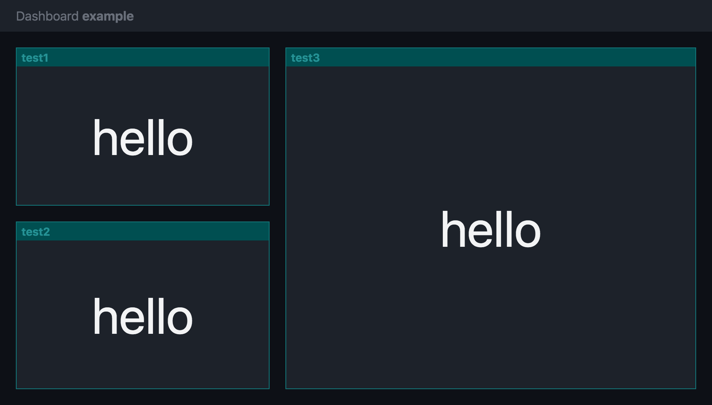

# taskworld-dashboard

A simple dashboard platform that runs on Firebase Database.
We use it to display metrics on our big TV screens.

## Design goals

Our goal is to:

1.  Minimize the need to maintain the dashboard platform.

2.  Allow the dashboard to be extensible without needing to modify any of the dashboard’s codebase at all.

3.  Make it easy to access. Employees should be able to access this dashboard when they are not at the office.

4.  Make it secure. Allow employees to access the dashboard but not the whole world.

5.  Make it easy to integrate with other dashboard systems. Allow `<iframe>` embedding.

6.  Support multiple screens, each displaying different information.

So our design choices become:

1.  Rather than creating a dashboard system that pulls data from multiple sources (pull model),
    this dashboard uses a push model instead:
    An external service (e.g. cron job) pushes the HTML to be rendered into the dashboard.
    The dashboard just renders it.

2.  Being based on Firebase Realtime database,
    dashboard display can be updated immediately when we push data to it.

3.  Using Firebase Authentication, we can specify who can access this dashboard.

## Data model in Firebase realtime database

### /pages/$pageId

This specifies each dashboard page, which can be accessed at `#/pages/$pageId`.

- `widgets`:
  - `$widgetId` specifies the ID of the widget to display:
    - `style` (string)
      - The CSS style to apply to that widget
      - Example: `"top:20px;left:20px;width:320px;height:200px;"`

### /widgets/$widgetId

This specifies the contents of the widget.

- `contents` (string)
  - The HTML to display. All styles should be inlined. This is easy if you use React to generate your widget.
  - Example: `"
hello
"`
- `updated` (number)
  - The timestamp in milliseconds since epoch representing the time that the widget is updated.

### /tokens/$token

If `true`, then the `$token` can be used to update the dashboard.

## API

The API is exposed as Cloud Function endpoints:

### POST /update

Updates the widget.

JSON request body:

- `token` (string)
  - The API token.
- `widget` (string) 
  - The ID of the widget to update.
- `contents` (string)
  - The HTML code to push to the widget.
